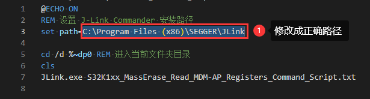

# S32K1xx 系列 MCU J-Link 解锁 

## 修改 JLink.bat

1. 用编辑器（比如VSCode）打开 `JLink.bat`
2. 如上图，修改 `set path=C:\Program Files (x86)\SEGGER\JLink` 中的路径为你自己的 JLink 软件安装目录
3. 修改完成后保存并关闭 `JLink.bat`

---

## 修改 S32K1xx_MassErase_Read_MDM-AP_Registers_Command_Script.txt

1. 用编辑器（比如VSCode）打开 `S32K1xx_MassErase_Read_MDM-AP_Registers_Command_Script.txt`
2. 如上图，修改 `device S32K144 (allow security)` 中的芯片型号，比如你使用的芯片为 `S32K116`，则修改为 `device S32K116 (allow security)`
3. 如上图，修改 `si SWD` 中所使用的调试接口，若为 `JTAG`，则需改为 `si JTAG`
4. 修改完成后保存并关闭 `S32K1xx_MassErase_Read_MDM-AP_Registers_Command_Script.txt`

## 执行解锁操作

1. 双击 `JLink.bat` 运行批处理即可
